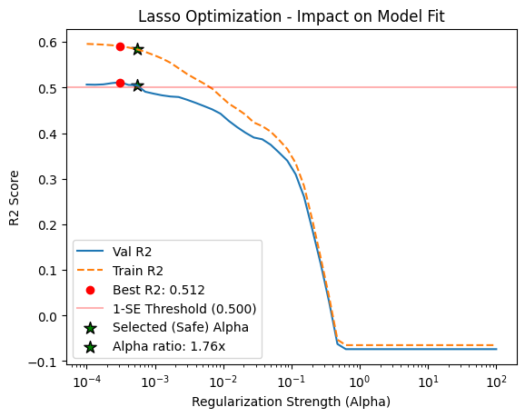

# Robust-ML-Workflows
This repository is a systematic exploration of predictive modeling, moving from foundational linear techniques to high-performance ensemble methods.
  
01. Regularized Regression and Variance Control:  
Goal: Address heteroscedasticity and stabilize high-dimensional polynomial models using automated stability selection.  
Key Techniques: Yeo-Johnson Target Transformations, Polynomial Interaction Features (139-dimension expansion), Ridge/Lasso/Elastic Net.  
Highlight: Implementation of the 1-SE Rule to select conservative hyperparameters that prevent overfitting in polynomial space. 
Result: Successfully reduced feature complexity from 139 to 48 predictors.

Status: Completed (Test $R^2$: 0.55 (41% lift over Baseline), OOB $R^2$: 0.52, Test $MAE$: 9.46).  

02. Tree models and ensembles:
Goal: Evaluate non-parametric approaches to capture interactions without explicit polynomial expansion.

   Status: In progress
