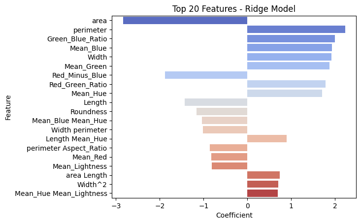

**Regularized Regression and Variance Control**

This project documents the systematic improvement of a regression model. The workflow transitions from 
a baseline linear model to a regularized 
Polynomial Ridge Regression model, utilizing target transformations and the One-Standard-Error (1-SE) rule
to ensure maximum generalization.
    
**Project Evolution & Methodology**
***1. Baseline Performance:*** The starting model achieved a CV $R^2$ of 0.47.
Error Analysis: Residual Plot shows non-constant variance - heteroscedasticity, a violation of linear regression
assumptions.
        
***2. Addressing Model Assumptions:*** To stabilize variance, a Yeo-Johnson transformation was applied to the target variable y. The post-transformation CV $R^2$ was 0.44, 
    
***3. Feature Engineering:*** Introducing higher-order and interaction terms led to a jump in features from  15 to 136.
This surge initially led to lower metrics ($R^2$ of 0.19) than the baseline. This is probably a result of 
overfitting or multicollinearity of features. It is known from EDA that multiple features are correlated,
the poly features will most likely add to it. 
    
***4. Regularization:*** Three Regularization Methods are employed. Lasso, Ridge, and Elastic Net.
Grid search for alpha did not select the alpha with the best mean;
instead, it selected an alpha value with mean value within one standard error from best_mean.
Generally, this method will select an alpha higher than that with the best mean, allowing better 
generalization. Ridge (L2) emerged as the strongest candidate with a CV $R^2$ of 0.52, five percentage 
points higher than the base model CV $R^2$.

***6. Bootstrap:*** A bootstrap simulation was performed to verify model stability by looking at the 95 confidence interval of $R^2$. Model showed a decent stability with 95% CI bounds between 0.3 and 0.58. Out of Bag $R^2$ was 0.53, which is very close to the CV $R^2$ (0.52) as well as the test $R^2$ (0.56). This consistency demonstrates a solid model that generalizes to new data.

***7. Feature Importance:*** Coefficients were extracted to assess feature importance. The
top 20 features, the most influential 11 features were just main effect features, while the 
remaining 9 were a mix of interaction and quadratic features. This confirmed that the relationship is non-linear 
and some specific feature combinations are important for model performance, balancing bias-variance
trade off.

***9. Final Thoughts:***
***a. Low bias in the baseline model:*** Simplistic assumption that the model function is linear, while in reality, the 
relationship is non-linear.
    
***b. High variance:*** In an attempt to increase the model complexity, features with higher other degrees were introduced, which led to severe overfitting, with the metric performing significantly poorer than the simplistic baseline model. 
    
***c. Regularization:*** This process helped to recover performance by limiting overfitting and encouraging simpler models that generalize better. Instead of just selecting the alpha value with the best mean from a grid search,
a (1-SE) technique was employed to allow selection of a larger alpha with a decent mean value (i.e., within 1 SE 
of the best mean). This also allowed for better generalization on new data. Ridge (L2) regularization 
performed slightly better than lasso and elastic net. This indicates that model performance is driven by 
many predictors with small or medium-sized effects.

***d. Influential Features:*** The top 20 influential features involve a combination of main, quadratic, and interaction effects, confirming the relationship as non-linear.

***e. Next Steps:*** Exploring non-linear estimators like tree-based methods and ensembles, given that poly 
terms were necessary to improve $R^2$.
